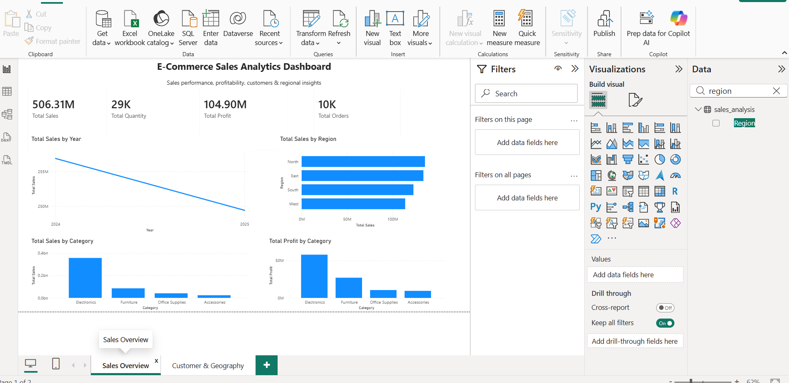
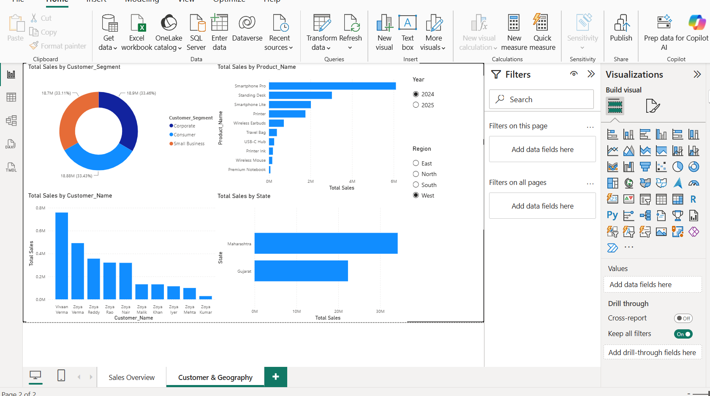

# 📊 E-Commerce Sales Analytics Dashboard

An interactive **E-Commerce Sales Analytics Dashboard** built using **Microsoft Power BI** and **Python** to analyze sales performance, profitability, customers, products, and regional trends.

The project demonstrates practical skills in **data analysis, data visualization, dashboard development, Python data processing, and business intelligence**.

---

## 📌 Project Overview

This project analyzes an e-commerce sales dataset and presents the results through an interactive Power BI dashboard.

The dashboard allows users to explore:

- 💰 Total Sales
- 📈 Profitability
- 📦 Quantity Sold
- 🧾 Number of Orders
- 👥 Customer Segments
- 🛍️ Product Performance
- 🌍 Regional Sales
- 🗺️ State-level Sales
- 📅 Sales Trends Over Time

Interactive filters allow users to analyze the data by **Year** and **Region**.

---

## 🛠️ Technologies Used

- **Microsoft Power BI** — Dashboard development and data visualization
- **Python** — Data generation and data preparation
- **Pandas** — Data processing and analysis
- **NumPy** — Numerical operations
- **CSV** — Dataset storage
- **Git & GitHub** — Version control and project hosting

---

## 📊 Dashboard Pages

### 1. Sales Overview

The Sales Overview page provides a high-level view of the e-commerce business.

It includes:

- Total Sales
- Total Quantity
- Total Profit
- Total Orders
- Sales trend by year
- Sales by region
- Sales by category
- Profit by category

### 2. Customer & Geography

The Customer & Geography page provides more detailed analysis of customers and geographical performance.

It includes:

- Sales by customer segment
- Sales by product
- Sales by customer
- Sales by state
- Year filter
- Region filter

---

## 💡 Key Insights

The dashboard can be used to identify:

- Which product categories generate the highest sales and profit
- Which regions contribute the most revenue
- Which states have stronger sales performance
- Which customer segments contribute significantly to revenue
- Which products are the strongest performers
- How sales performance changes over time

---

## 📁 Project Structure

```text
ecommerce-powerbi-dashboard/
│
├── data/
│   ├── customers.csv
│   ├── order_items.csv
│   ├── orders.csv
│   ├── products.csv
│   └── sales_analysis.csv
│
├── python/
│   ├── generate_data.py
│   └── prepare_dashboard_data.py
│
├── Ecommerce_Sales_Analytics_Dashboard.pbix
├── .gitignore
└── README.md

## 📊 Dashboard Preview

### Sales Overview



### Customer & Geography

